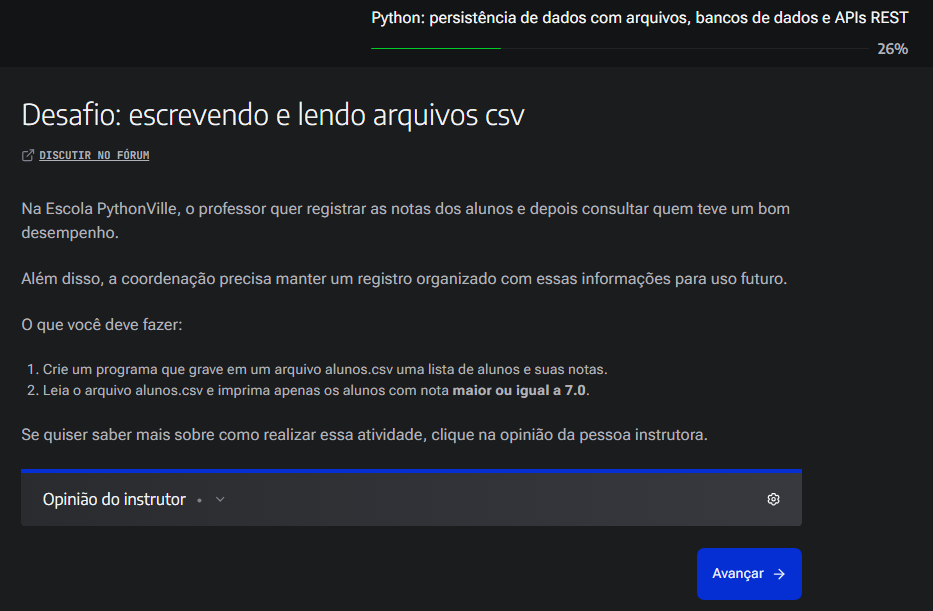

Atividade de Permanencia de Dados CSV
Desafio: escrevendo e lendo arquivos csv

Escolinha_da_P-_Karine/
├── dados/
│   └── notas.csv              # Henrique,7 / Dominic,9 / Karine,10
├── mecanismos/
│   ├── input_notas.py         # ✅ menu 1/2, valida float
│   ├── ler_dados.py           # ✅ lê como float, com proteções
│   ├── calcular_notas.py      # ✅ exibir_aprovados / exibir_reprovados
│   └── menu_options.py        # ✅ reimprime menu a cada loop
├── main.py                    # ✅ sem exibir_menu duplicado
└── README.md

## Como rodar

'''bash (terminal)'''
python main.py